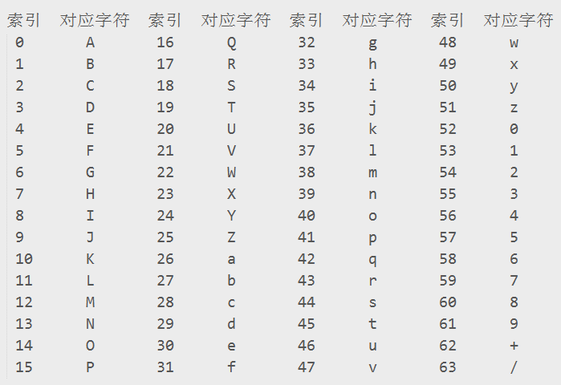

## BASE64 加密算法、原理

### 简介

　　标准的Base64并不适合直接放在URL里传输，因为URL编码器会把标准Base64中的“/”和“+”字符变为形如“%XX”的形式，而这些“%”号在存入数据库时还需要再进行转换，因为ANSI SQL中已将“%”号用作通配符。

　　为解决此问题，可采用一种用于URL的改进Base64编码，它不在末尾填充'='号，并将标准Base64中的“+”和“/”分别改成了“*”和“-”，这样就免去了在URL编解码和数据库存储时所要作的转换，避免了编码信息长度在此过程中的增加，并统一了数据库、表单等处对象标识符的格式。

　　另有一种用于正则表达式的改进Base64变种，它将“+”和“/”改成了“!”和“-”，因为“+”,“*”以及前面在IRCu中用到的“[”和“]”在正则表达式中都可能具有特殊含义。

　　此外还有一些变种，它们将“+/”改为“_-”或“._”（用作编程语言中的标识符名称）或“.-”（用于XML中的Nmtoken）甚至“_:”（用于XML中的Name）。

　　Base64要求把每三个8Bit的字节转换为四个6Bit的字节（3*8 = 4*6 = 24），然后把6Bit再添两位高位0，组成四个8Bit的字节，也就是说，转换后的字符串理论上将要比原来的长1/3。

### 规则

　　关于这个编码的规则：

　　①.把3个字符变成4个字符

　　②每76个字符加一个换行符

　　③.最后的结束符也要处理

　　这样说会不会太抽象了？不怕，我们来看一个例子：

　　转换前 aaaaaabb ccccdddd eeffffff

　　转换后 00aaaaaa 00bbcccc 00ddddee 00ffffff

　　应该很清楚了吧？上面的三个字节是原文，下面的四个字节是转换后的Base64编码，其前两位均为0。

　　转换后，我们用一个码表来得到我们想要的字符串（也就是最终的Base64编码），这个表是这样的：（摘自RFC2045）

### 举例

　　让我们再来看一个实际的例子，加深印象！

　　转换前 10101101 10111010 01110110

　　转换后 00101011 00011011 00101001 00110110

　　十进制 43 27 41 54

　　对应码表中的值 r b p 2

　　所以上面的24位编码，编码后的Base64值为rbp2

　　解码同理，把 rbq2 的二进制位连接上再重组得到三个8位值，得出原码。

##### 用更接近于编程的思维来说，编码的过程是这样的：

　　第一个字符通过右移2位获得第一个目标字符的Base64表位置，根据这个数值取到表上相应的字符，就是第一个目标字符。

　　然后将第一个字符左移4位加上第二个字符右移4位，即获得第二个目标字符。

　　再将第二个字符左移2位加上第三个字符右移6位，获得第三个目标字符。

　　最后取第三个字符的右6位即获得第四个目标字符。

　　在以上的每一个步骤之后，再把结果与 0x3F 进行 AND 位操作，就可以得到编码后的字符了。

　　可是等等……聪明的你可能会问到，原文的字节数量应该是3的倍数啊，如果这个条件不能满足的话，那该怎么办呢？

　　我们的解决办法是这样的：原文的字节不够的地方可以用全0来补足，转换时Base64编码用=号来代替。这就是为什么有些Base64编码会以一个或两个等号结束的原因，但等号最多只有两个。因为：

　　余数 = 原文字节数 MOD 3

　　所以余数任何情况下都只可能是0，1，2这三个数中的一个。如果余数是0的话，就表示原文字节数正好是3的倍数（最理想的情况啦）。如果是1的话，为了让Base64编码是3的倍数，就要补2个等号；同理，如果是2的话，就要补1个等号。

### 各种下载软件地址

　　先以“迅雷下载”为例：很多下载类网站都提供“迅雷下载”的链接，其地址通常是加密的迅雷专用下载地址。

　　如thunder://QUFodHRwOi8vd3d3LmJhaWR1LmNvbS9pbWcvc3NsbTFfbG9nby5naWZaWg==

　　其实迅雷的“专用地址”也是用Base64加密的，其加密过程如下：

　　一、在地址的前后分别添加AA和ZZ

　　如www.baidu.com/img/sslm1_logo.gif变成

　　AAwww.baidu.com/img/sslm1_logo.gifZZ

　　二、对新的字符串进行Base64编码

　　如AAwww.baidu.com/img/sslm1_logo.gifZZ用Base64编码得到

　　QUF3d3cuYmFpZHUuY29tL2ltZy9zc2xtMV9sb2dvLmdpZlpa

　　三、在上面得到的字符串前加上“thunder://”就成了

　　thunder://QUF3d3cuYmFpZHUuY29tL2ltZy9zc2xtMV9sb2dvLmdpZlpa

　　另：

　　Flashget的与迅雷类似，只不过在第一步时加的“料”不同罢了，Flashget在地址前后加的“料”是[FLASHGET]

　　而QQ旋风的干脆不加料，直接就对地址进行Base64编码了