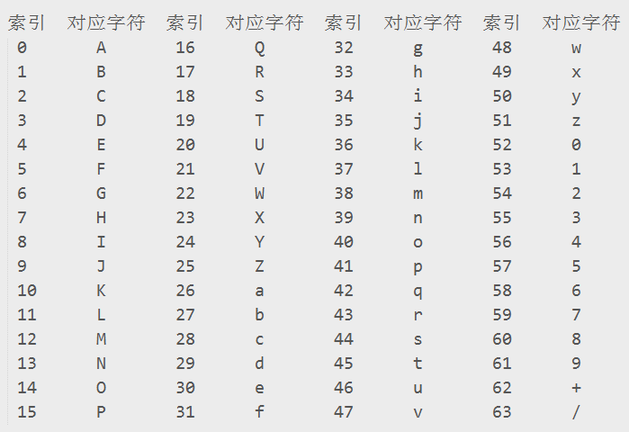
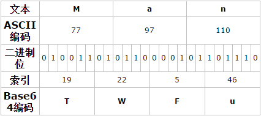
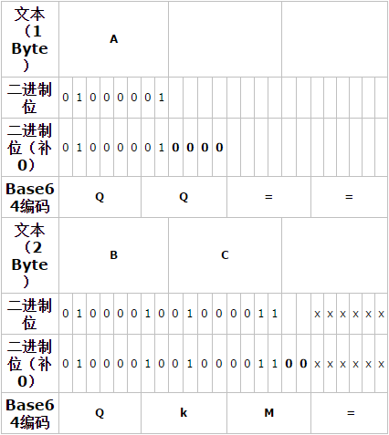

## Base64 算法原理，以及编码、解码【加密、解密】 介绍

　　Base64编码，是我们程序开发中经常使用到的编码方法。它是一种基于用64个可打印字符来表示二进制数据的表示方法。它通常用作存储、传输一些二进制数据编码方法！也是MIME（多用途互联网邮件扩展，主要用作电子邮件标准）中一种可打印字符表示二进制数据的常见编码方法！它其实只是定义用可打印字符传输内容一种方法，并不会产生新的字符集！有时候，我们学习转换的思路后，我们其实也可以结合自己的实际需要，构造一些自己接口定义编码方式。好了，我们一起看看，它的转换思路吧！

### Base64实现转换原理

　　它是用64个可打印字符表示二进制所有数据方法。由于2的6次方等于64，所以可以用每6个位元为一个单元，对应某个可打印字符。我们知道三个字节有24个位元，就可以刚好对应于4个Base64单元，即3个字节需要用4个Base64的可打印字符来表示。在Base64中的可打印字符包括字母A-Z、a-z、数字0-9 ，这样共有62个字符，此外两个可打印符号在不同的系统中一般有所不同。但是，我们经常所说的Base64另外2个字符是：“+/”。这64个字符，所对应表如下。

　　转换的时候，将三个byte的数据，先后放入一个24bit的缓冲区中，先来的byte占高位。数据不足3byte的话，于缓冲区中剩下的bit用0补足。然后，每次取出6个bit，按照其值选择
ABCDEFGHIJKLMNOPQRSTUVWXYZabcdefghijklmnopqrstuvwxyz0123456789+/中的字符作为编码后的输出。不断进行，直到全部输入数据转换完成。

　　如果最后剩下两个输入数据，在编码结果后加1个“=”；如果最后剩下一个输入数据，编码结果后加2个“=”；如果没有剩下任何数据，就什么都不要加，这样才可以保证资料还原的正确性。

　　编码后的数据比原始数据略长，为原来的4/3。无论什么样的字符都会全部被编码，因此不像Quoted-printable编码，还保留部分可打印字符。所以，它的可读性不如Quoted-printable编码！

　　M的Ascii码是77,前六位对应值为19，对应base64字符是T，如此类推。其它字符编码就可以自动转换得到！我们看看另外不是刚好是3个字节的情况！

### Base64解码

　　解码是编码的逆过程，先看后面补了几个“=”号，最多只可能补2个“=”号。一个“=”相当于补了2个0，所以去掉后面补的0后，再按8位展开，即可还原。