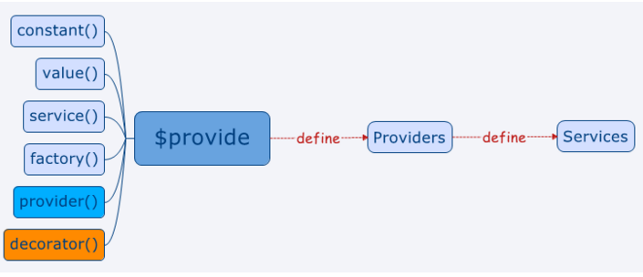

##Service、Factory、Provider依赖注入使用与区别

    用有过Spring的人都知道，Spring的核心思想就是DI(依赖注入,Dependency Injection)和IOC(控制反转 Invension of Controller),AngularJS的service其实就是用到了这里的DI思想，那么什么叫做DI?所谓DI，就是指对象是被动接受依赖类而不是自己主动去找，换句话说就是指对象不是从容器中查找它依赖的类，而是在容器实例化对象的时候主动将它依赖的类注入给它。我个人的理解就是，你在实例化一个类时，它会自动去实例化它里面所用到的其它实例。所以这就叫依赖注入。在Angular里面，services作为单例对象在需要到的时候被创建，只有在应用生命周期结束的时候（关闭浏览器）才会被清除。而controllers在不需要的时候就会被销毁了。

    AngualrJs中可用来注入的有三种类型，service、factory、provider,这三种写法不样，用法也都不一样。其中，service只实例化一次，其实就是单例模式的思想。无论我们在什么地方注入我们的service，将永远使用同一个实例。所以对很多在controller层中的操作就可以放到serivce层中去。AngularJS提供例如许多内在的服务，如：$http, $route, $window, $location等。每个服务负责例如一个特定的任务，$http是用来创建AJAX调用，以获得服务器的数据。 $route用来定义路由信息等。内置的服务总是前缀$符号。

    其中，三者的关系可以看成是下图：

###一、Service使用详解

####（1）定义

    一个学用的service用法如下：

    一般直接用this来操作数据、定义函数。

    app.service('myService', function() {  
        var privateValue = "I am Private";  
        this.variable = "This is public";  
        this.getPrivate = function() { return privateValue;  
    };  
    }); 

####（2）AngularJS中使用DI添加Service的三种方法

#####方式1（内联注解，推荐使用）：

    app.controller('myController', ['$scope', 'dateFilter', function ($scope, dateFilter) { }]); 

#####方式2（$inject注解）：

    var MyController = function($scope, dateFilter) {}  
    MyController.$inject = ['$scope', 'dateFilter'];  
    someModule.controller('MyController', MyController);

#####方式3（隐式注解，不推荐使用）：

    app.controller('myController', function ($scope, dateFilter) { });

#####推荐使用方式1的理由是：

    (1)写法上比方法2更简单明了
    (2)比方法3更可靠（由于Javascript可以被压缩，AngularJS又是通过解析服务名称找到对应Service的，因此Javascript压缩之后AngularJS将无法找到指定的Service，但字符串不会被压缩，因此单独以字符串指定Service的名称可以避免这个问题）

#####使用方式1或方式2的注意点：

    由于上述第二点原因，AngularJS在编译Html时，由$injector将数组中Service的名称与方法体中的Service进行一一映射。这种映射关系必须遵守由AngularJS的约定：
    
######数组中Service名称的个数必须与方法体中Service名称的个数一致
######数组中Service的顺序必须与方法体中Serivce的顺序一致

####（3）什么时候适合使用service()方法

    service()方法很适合使用在功能控制比较多的service里面
    注意：需要使用.config()来配置service的时候不能使用service()方法

####（4）service使用实例 

    一个完整实例：

    <!DOCTYPE html>  
    <html lang="zh" ng-app="myApp">  
    <head>  
        <meta charset="UTF-8">  
        <title>AngularJS学习</title>  
          
    </head>  
    <body>  
        
  
            <button ng-click="getPrivate()">按钮一</button>  
            <button ng-click="getPUbluc()">按钮二</button>  
        
  
        
  
        
  
    </body>  
      
    </html>

    另外，两个controller注入同一个service，但是最终只实例化了一次！

    注意：seivce定义的服务不能在.config中使用！只有provider定义的才可以。

###二、Factory使用详解

    Factory 一般就是创建一个对象，然后在对这个对象添加方法与数据，最后将些对象返回即可。然后注入到Controller层中即可。

    使用实例：

    <!DOCTYPE html>  
    <html lang="zh" ng-app="myApp">  
    <head>  
        <meta charset="UTF-8">  
        <title>AngularJS学习</title>  
          
    </head>  
    <body>  
        
  
            <button ng-click="getPrivate()">按钮一</button>  
            <button ng-click="getPUbluc()">按钮二</button>  
        
  
        
  
        
  
    </body>  
      
    </html>

    两个Controller注入同一个factory，但是最终只实例化了一次!

    记得一定要return一个Object对象,否则会报错误。

###三、provider使用详解

    $provide服务负责告诉Angular如何创造一个新的可注入的东西：即服务。服务会被叫做供应商的东西来定义，你可以使用$provide来创建一个供应商。你需要使用$provide中的provider()方法来定义一个供应商，同时你也可以通过要求$provide被注入到一个应用的config函数中来获得$provide服务。使用方法是返回一个$get函数，注意在config阶段，只有provider能被注入。其它用法和service一样。
    
    下面是一个实例。

    <!DOCTYPE html>  
    <html lang="zh" ng-app="myApp">  
    <head>  
        <meta charset="UTF-8">  
        <title>AngularJS学习</title>  
          
    </head>  
    <body>  
        
  
            <button ng-click = "onclick1()">请点击我1</button>  
        
  
        
  
             <button ng-click = "onclick2()">请点击我2</button>  
        
  
    </body>  
      
    </html>

    只实例化了一次

    再来做一个provider实例化的时间测试：

    <!DOCTYPE html>  
    <html lang="zh" ng-app="myApp">  
      
    <head>  
        <meta charset="UTF-8">  
        <title>AngularJS学习</title>  
          
    </head>  
      
    <body>  
        
  
            <button ng-click="onclick1()">请点击我1</button>  
        
  
        
  
            <button ng-click="onclick2()">请点击我2</button>  
        
  
    </body>  
      
      
    </html>

######页面刷新后，我们发现即使不注入这个providrer，但也它也进行实例化了，而sersvice/factory则是第一次注入时才会初始化。而也这是为什么它可以注入到config的一个原因吧！

######什么时候使用provider()方法
    （1）当我们希望在应用开始前对service进行配置的时候就需要使用到provider()。比如，我们需要配置services在不同的部署环境里面（开发，演示，生产）使用不同的后端处理的时候就可以使用到了。
    （2）当我们打算发布开源provider()也是首选创建service的方法，这样就可以使用配置的方式来配置services而不是将配置数据硬编码写到代码里面。

###四、Service、Factory、Provider三者区别

    1) 用 Factory 就是创建一个对象，为它添加属性，然后把这个对象返回出来。你把 service 传进 controller 之后，在 controller 里这个对象里的属性就可以通过 factory 使用了。
    2) Service 是用"new"关键字实例化的。因此，你应该给"this"添加属性，然后 service 返回"this"。你把 service 传进 controller 之后，在controller里 "this" 上的属性就可以通过 service 来使用了。
    3) Providers 是唯一一种你可以传进 .config() 函数的 service。当你想要在 service 对象启用之前，先进行模块范围的配置，那就应该用 provider。
    4）Factory/service是第一个注入时才实例化，而provider不是，它是在config之前就已实例化好

    同一函数三种不同写法：

    <!DOCTYPE html>  
    <html lang="zh" ng-app="myApp">  
    <head>  
        <meta charset="UTF-8">  
        <title>AngularJS学习</title>  
          
    </head>  
    <body>  
        
  
            
{{ output1 }}
  
            
{{ output2 }}
  
            
{{ output3 }}
  
        
  
        
  
        
  
    </body>  
      
    </html> 

    看console的输出，可以知道都只实例 化了一次

###参考文章：

    http://www.cnblogs.com/wushangjue/p/4533953.html?utm_source=tuicool&utm_medium=referral
    http://www.oschina.net/translate/angularjs-factory-vs-service-vs-provider
    http://my.oschina.net/tanweijie/blog/295067
    http://www.360doc.com/content/15/1010/18/28162318_504719466.shtml