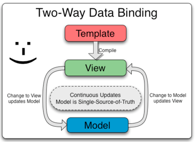
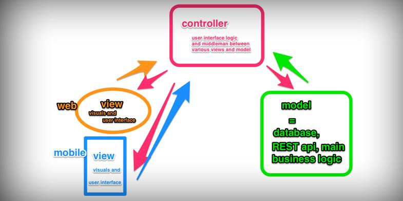

##AngularJs入门及第一个实例

###一、AngualrJs简介

    AngularJS是由谷歌开发出来的，它是为了克服HTML在构建应用上的不足而设计的。HTML是一门很好的为静态文本展示设计的声明式语言，但要构建WEB应用的话它就显得乏力了。通常，我们是通过以下技术来解决静态网页技术在构建动态应用上的不足：AngularJS使用了不同的方法，它尝试去补足HTML本身在构建应用方面的缺陷。AngularJS通过使用我们称为标识符(directives)的结构，让浏览器能够识别新的语法。

    例如：
    （1）使用双大括号{{}}语法进行数据绑定；
    （2）使用DOM控制结构来实现迭代或者隐藏DOM片段；
    （3）支持表单和表单的验证；
    （4）能将逻辑代码关联到相关的DOM元素上；
    （5）能将HTML分组成可重用的组件。
         
    AngularJS可以认为是一个MVC模式的框架Model-View-Controller)，其中M代码scope,V代表Html展示元素，C代表Controller.你也可以将它看成是一个MVVM模式的框架（Model-View-ViewModel），其中其中M代码scope中的数据,V代表Html展示元素，VM代表scope.AngularJS和Jquery的设计思想完成不同，你不需要去冗长的代码去控制DOM元素，一些Html上的元素都和scope上的数据进行一个双向绑定，你只需要更新scope上的数据，Html自动会发生改变。同理，你如果修改html上的数据，如input上的输入值 ，对就的scope也会接收到你的改变，从而实时更新。当然，这只是它很小一部份的功能，更多的包括指令、路由、服务等，也可以大大加快开发的速度。

###二、特性

####1、数据绑定

    数据绑定可能是AngularJS最酷最实用的特性。它能够帮助你避免书写大量的初始代码从而节约开发时间。一个典型的web应用可能包含了80%的代码用来处理，查询和监听DOM。数据绑定使得代码更少，你可以专注于你的应用。

    传统来说，当model变化了。 开发人员需要手动处理DOM元素并且将属性反映到这些变化中。这个一个双向的过程。一方面，model变化驱动了DOM中元素变化，另一方面，DOM元素的变化也会影响到Model。这个在用户互动中更加复杂，因为开发人员需要处理和解析这些互动，然后融合到一个model中，并且更新View。这是一个手动的复杂过程，当一个应用非常庞大的时候，将会是一件非常费劲的事情。

####2、模板

    在AngularJS中，一个模板就是一个HTML文件。但是HTML的内容扩展了，包含了很多帮助你映射model到view的内容。

    HTML模板将会被浏览器解析到DOM中。DOM然后成为AngularJS编译器的输入。AngularJS将会遍历DOM模板来生成一些指导，即，directive（指令）。所有的指令都负责针对view来设置数据绑定。

    我们要理解AuguarJS并不把模板当做String来操作。输入AngularJS的是DOM而非string。数据绑定是DOM变化，不是字符串的连接或者innerHTML变化。使用DOM作为输入，而不是字符串，是AngularJS区别于其它的框架的最大原因。使用DOM允许你扩展指令词汇并且可以创建你自己的指令，甚至开发可重用的组件。

####3、MVC

    针对客户端应用开发AngularJS吸收了传统的MVC基本原则。MVC或者Model-View-Controll设计模式针对不同的人可能意味不同的东西。AngularJS并不执行传统意义上的MVC，更接近于MVVM（Model-View-ViewModel)。其中MVC原理图可以看看下面的图片。

####4、依赖注入（Dependency Injection，即DI）

    AngularJS拥有内建的依赖注入子系统，可以帮助开发人员更容易的开发，理解和测试应用。

    DI允许你请求你的依赖，而不是自己找寻它们。比如，我们需要一个东西，DI负责找创建并且提供给我们。

####5、Directives（指令）

指令可以用来创建自定义的标签。它们可以用来装饰元素或者操作DOM属性。

###三、实例讲解

####（1）入门实例一

    <!DOCTYPE html>  
    <html lang="en" ng-app="">  
    <head>  
        <meta charset="UTF-8">  
        <title>AngularJS入门学习</title>  
          
    </head>  
    <body>  
        
<input  type="text" ng-model = "inputValue">请输入内容
  
        <h1>您输入的内容为：{{inputValue}}</h1>  
    </body>  
    </html>  

    注意事项：
    文本输入指令<input ng-model="inputValue" />绑定到一个叫inputValue的模型变量。
    双大括号标记将yourname模型变量添加到问候语文本。
    你不需要为该应用另外注册一个事件侦听器或添加事件处理程序！
    这个页面非常简洁，如果用Jquery写，那么就得设置input框 的chang中事件，然后更新内容。这一过程比AngularJS来得繁琐多了。

####（2）入门实例2

    下面现来看一个带Controller层的：

    <!DOCTYPE html>  
    <html lang="en" ng-app="myApp">  
    <head>  
        <meta charset="UTF-8">  
        <title>AngularJS入门学习</title>  
          
    </head>  
    <body ng-controller = "myController">  
        
<input  type="text" ng-model = "inputValue">请输入内容
  
        <h1>您输入的内容为：{{inputValue}}</h1>  
    </body>  
      
    </html>  

    注意，ng-app="myApp",这个不能少，还有ng-controller=“”也不能少，这两个分别批明了AngularJS有效的范围和Controller层有效的范围。

    这里因为我们设置了$scope.inputValue="林炳文Evankaka";所以一打开页面，input中就已自动填充 "林炳文Evankaka";

    myController—控制器方法的名字和<body>标签里面的ngController指令的值相匹配。

    input的数据此时与注入到我们控制器函数的作用域（$scope）相关联。当应用启动之后，会有一个根作用域被创建出来，而控制器的作用域是根作用域的一个典型后继。这个控制器的作用域对所有<body ng-controller="myController">标记内部的数据绑定有效。

####(3)入门实例3

    接下来使用一个带有多种ng指令的实例，这时实现的功能是点击按钮一下，显示内容，再点击一个，隐藏内容

    <!DOCTYPE html>  
    <html lang="en" ng-app="myApp">  
    <head>  
        <meta charset="UTF-8">  
        <title>AngularJS入门学习</title>  
          
    </head>  
    <body ng-controller = "myController">  
        <button ng-click= "myClick()" ></button>  
        <h1 ng-if = "!flag"> 我是林炳文Evankaka</h1>  
    </body>  
      
    </html>